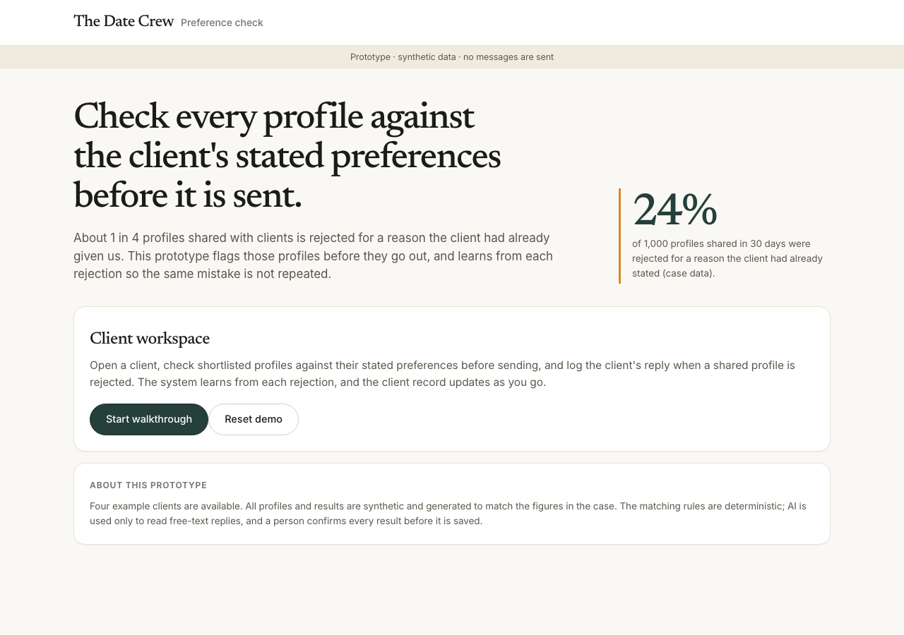
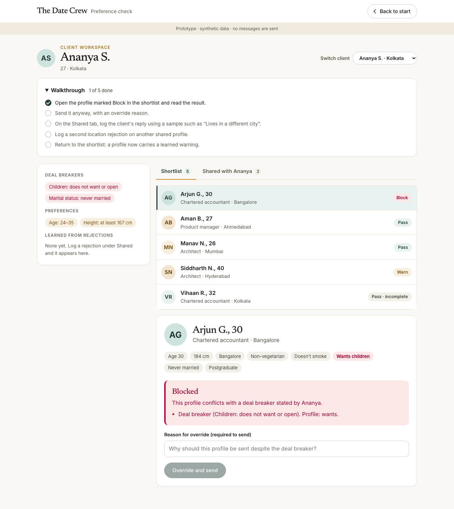
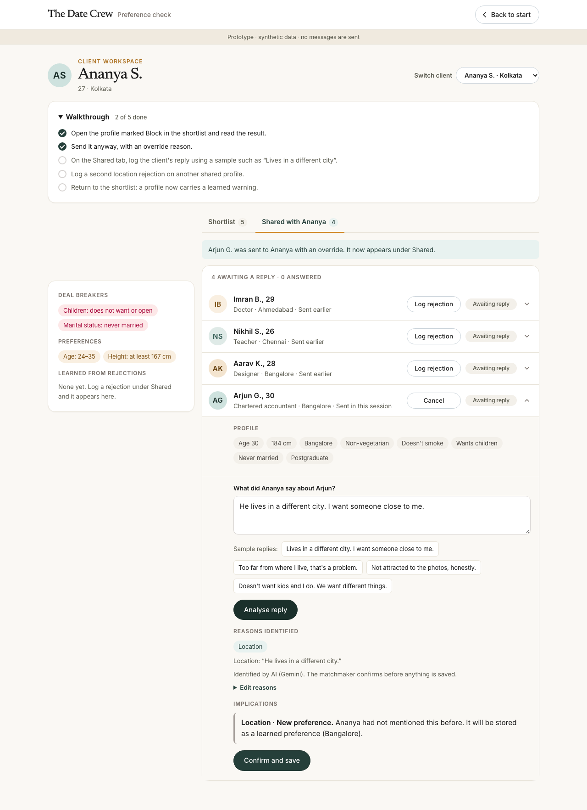
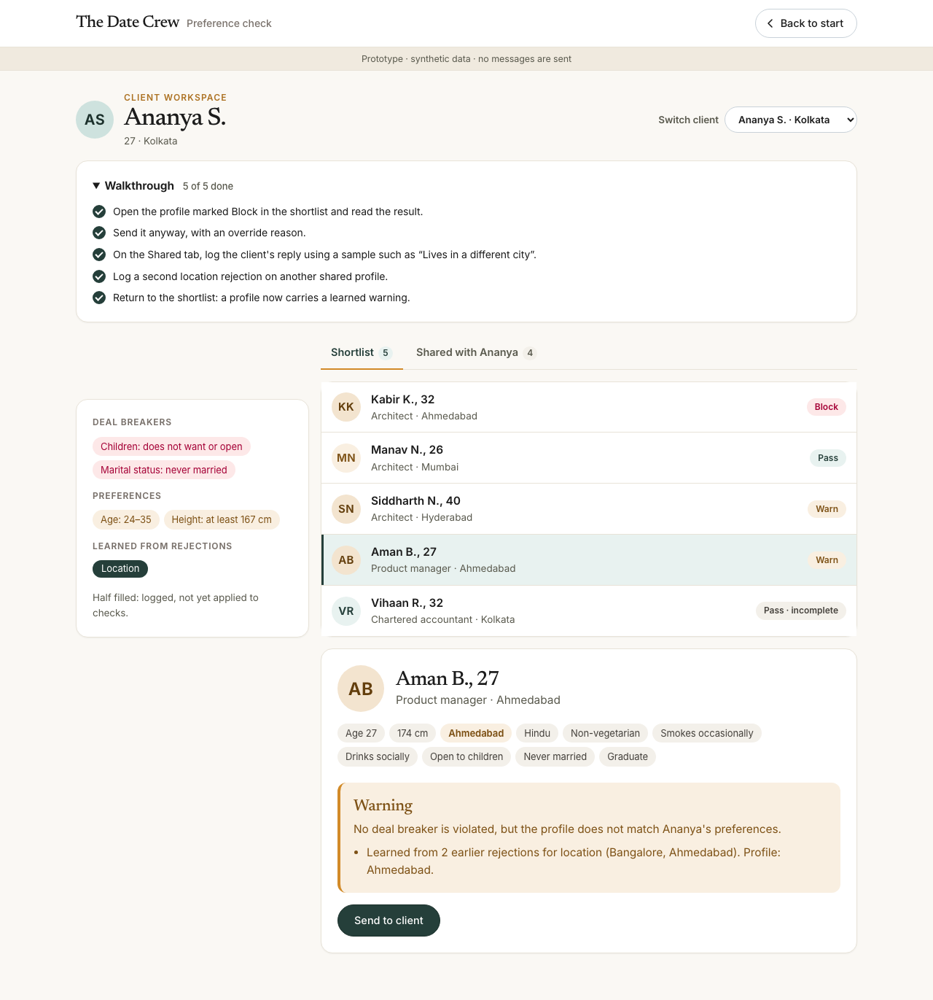

# Pre-send preference check

Prototype for The Date Crew product assessment (Part 3). It demonstrates the core of the proposed solution: **check every profile against a client's stated preferences before it is sent, and learn from every rejection.**

About 1 in 4 profiles shared with clients is rejected for a reason the client had already given us. This prototype flags those profiles before they go out, and turns each rejection into something the system remembers.

**All data is synthetic, and nothing is emailed to anyone.**

| | |
|---|---|
|  |  |
|  |  |

## What it does

Open the app and start from the intro page; the walkthrough takes about two minutes.

**Client workspace.** One client is open at a time (a switcher offers three more). The record on the left shows deal breakers, preferences, anything the client mentioned in conversation, and what has been learned from rejections. Two tabs sit on the right:

- **Shortlist.** Five candidate profiles. Opening one shows its details and a verdict:
  - **Pass**: no conflicts.
  - **Warn**: a soft preference is not met.
  - **Block**: a deal breaker is violated. It can be overridden only with a recorded reason.
  - **Pass · incomplete**: the profile does not state something the client cares about.
- **Shared.** Profiles already sent to the client. Each profile is an accordion: click the row to open or close it. Each row reads left to right: profile, **Log rejection** (only for profiles awaiting a reply), status, chevron. Only shared profiles can be rejected, and the reply form opens beneath the row.

**Learning from a rejection.** The client's free-text reply is read by an LLM and mapped onto a fixed reason list. The matchmaker confirms or edits the reasons. A reason the client had not stated before is stored as a learned preference, shown as a pill that fills as the reason repeats: half filled after one rejection (logged, not yet applied), fully filled after two (now applied). From then on, the shortlist warns on similar profiles.

A short walkthrough checklist at the top ticks off as you go. **Back to start** returns to the intro page, and **Reset demo** (on the intro page) clears everything recorded in the session.

## Run it

```bash
npm install
cp .env.example .env.local   # optional: add a Gemini API key (see below)
npm run dev                  # http://localhost:3000
npm test                     # unit tests for the checker
npm run generate             # regenerate the synthetic data (deterministic)
```

## AI tagging

`/api/tag` calls the Gemini API when `GEMINI_API_KEY` is set, constrained to the fixed reason list with structured JSON output. Get a free key at <https://aistudio.google.com/apikey> and put it in `.env.local` (git-ignored). Model names change, so `GEMINI_MODEL` is configurable; if it fails the app tries `gemini-3.5-flash-lite`, then `gemini-3.5-flash`.

If there is no key, the call fails, or the small per-IP demo limit is hit, it falls back to a keyword matcher, so the demo always works. The key stays server-side.

The tagger is one function (`lib/tagger.ts`: text in, reasons out). The production design uses Claude Sonnet 5.5 behind the same function; a free tier is used here so the demo costs nothing. Free tiers may use inputs to improve products, which is fine for synthetic data but not for real client replies.

## Design choices worth knowing

- **The checker is plain rules, not an LLM.** It is reliable, explainable, and unit-tested. The LLM is used only for messy free text, and a person confirms every tag.
- **Override, not a hard lock.** Matchmakers keep the final say, and the override log is data: it later shows which "deal breakers" are not really deal breakers.
- **Missing data is never a pass-through.** A missing profile field is reported as "can't check".
- **Two tiers of preference.** Deal breakers are enforced; everything else is a soft signal that is learned from behaviour.
- **Look and feel.** It follows the design language of thedatecrew.com: warm cream background, deep green with mustard accents, serif headings over a clean sans, pill buttons. The site's own serif is licensed, so Newsreader stands in for it; body text uses Inter.

## Project structure

```
app/            screens (intro, client workspace) and the /api/tag route
lib/            checker, shortlist, tagger, reason list, local state
data/           synthetic clients, profiles and 1,000 past shares
scripts/        deterministic data generator
tests/          unit tests for the checker
```

## Limits of this prototype

- The data is synthetic. `data/shares.json` mirrors the case numbers (1,000 shares, 31% accepted, about 24% rejected for something already stated, matchmaker A at 44% and B at 21%) but is not shown in the app.
- State lives in the browser (`localStorage`). There is no login, database, or real data import.
- The fixed reason list is lossy by design. For example, "her family is very traditional" is tagged as Religion / community because there is no "family / values" reason. In production the list would be built by clustering real rejections.
